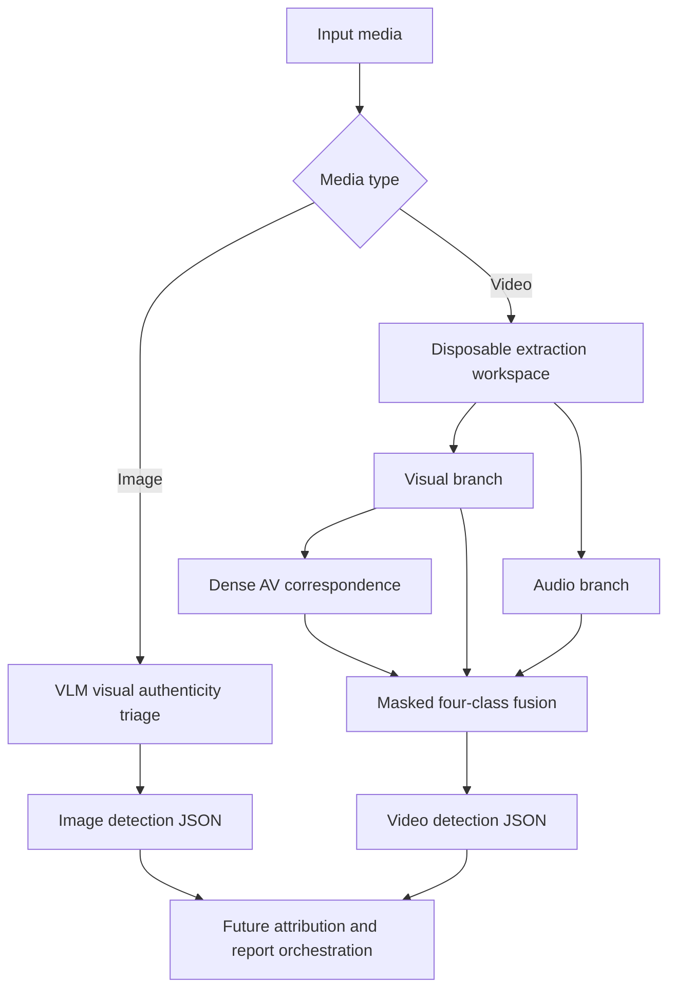

# Pramaan-X

> A multimodal forensic-evidence prototype for detecting visual, audio, and audio-visual manipulation in media.

Built for the Chandigarh Police Hackathon, Pramaan-X turns uploaded video or image media into a structured, investigator-oriented detection record. Video evidence is kept separate until masked fusion combines it into one four-class assessment. Still images use a clearly separate, conservative multimodal-LLM triage path.

It is designed to support an investigator's workflow, not to replace one. A model score is a lead for human review alongside provenance, metadata, and independent forensic examination.

## The problem

Manipulated media is not one uniform phenomenon. A video may have:

- synthetic or altered visual content with authentic audio;
- cloned, replaced, or manipulated audio with authentic video;
- manipulation in both modalities; or
- audio and mouth motion that do not correspond temporally.

A single binary classifier cannot make these distinctions or explain which evidence channel it relied on. Pramaan-X therefore treats each channel as independent forensic evidence and preserves missing evidence explicitly.

## What Pramaan-X delivers

### Video analysis

1. A four-class prediction: real, visual manipulation, audio manipulation, or audio-visual manipulation.
2. Separate branch evidence and availability masks for visual, audio, and dense audio-mouth correspondence.
3. Counterfactual modality analysis that shows whether the decision survives when one available evidence channel is masked.
4. A timestamped dense AV correspondence timeline rather than only a file-level average.
5. A strict JSON artifact with checkpoint and extraction provenance.

### Image analysis

1. LLM-assisted visual authenticity assessment for JPG, JPEG, PNG, and WEBP files.
2. Conservative labels: `LIKELY_AUTHENTIC`, `SUSPICIOUS`, or `LIKELY_MANIPULATED`.
3. Structured visual findings across anatomy, hands, lighting, reflections, textures, background, text, and compositing.
4. Input SHA-256, dimensions, format, file size, and non-conclusive EXIF metadata.

### Future attribution integration

Source tracing, provenance reconstruction, and dissemination attribution are a separate subsystem. They are intended to be combined with detection at the final orchestration and investigator-report layer.

## Class contract

| Index | Class | Meaning |
|---:|---|---|
| 0 | `REAL` | No manipulation class selected by this model |
| 1 | `VISUAL_MANIPULATION` | Visual evidence is consistent with manipulation |
| 2 | `AUDIO_MANIPULATION` | Audio evidence is consistent with manipulation |
| 3 | `AUDIO_VISUAL_MANIPULATION` | Both visual and audio manipulation class is selected |

These are model classes, not legal findings. Missing evidence is masked and is never treated as evidence that the media is real.

## End-to-end flow



### Step by step

1. **Ingest and isolate**: the raw-video wrapper creates a temporary per-video workspace. It does not write into accepted training caches.
2. **Extract visual evidence**: sampled frames are processed through a frozen ConvNeXt-Tiny backbone using face and mouth features.
3. **Extract audio evidence**: the audio track is analysed using the XLSR-SLS anti-spoofing feature path and a lightweight accepted audio head.
4. **Measure AV correspondence**: where usable audio and mouth features overlap, short timestamped segments are scored for audio-mouth correspondence sensitivity.
5. **Fuse only available evidence**: the lightweight fusion head receives branch logits plus availability masks. A missing branch uses the representation learned by the fusion model for missing evidence, not an invented negative-risk value.
6. **Produce explainable structured evidence**: the result retains class scores, branch states, AV timeline records, counterfactual modality analyses, and artifact provenance.

## Architecture

| Evidence channel | Role in the final system | Output kept for fusion |
|---|---|---|
| Visual | Detects visual manipulation cues from face and mouth temporal features | Visual manipulation logit and availability mask |
| Audio | Detects manipulated or synthetic audio cues | Audio manipulation logit and availability mask |
| Dense AV | Measures sensitivity to temporal audio-mouth correspondence | AV inconsistency logit, availability mask, and timestamped segment logits |
| Masked fusion | Resolves the four semantic classes from the available evidence | Four class logits, uncalibrated softmax scores, selected class |
| Image VLM path | Performs conservative still-image visual authenticity triage | Categorical assessment, structured findings, input integrity metadata |
| Attribution layer | Reconstructs source and dissemination evidence later | Separate future attribution result |

The production path uses frozen heavy extractors, compact cached features, and lightweight PyTorch heads. This makes the system feasible on constrained GPU hardware while avoiding an end-to-end graph containing all backbones at once.

## Investigator-oriented evidence

### 1. Counterfactual Modality Analysis

After visual, audio, and AV evidence is extracted once, Pramaan-X reruns only the lightweight fusion head while masking each **originally available** modality in turn.

```text
Full evidence:       visual + audio + AV  -> selected class
Without visual:      audio + AV           -> selected class
Without audio:       visual + AV           -> selected class
Without dense AV:    visual + audio        -> selected class
```

This lets an investigator ask whether the conclusion is stable when an evidence channel is removed. The JSON is stored under `counterfactual_modality_analysis` and contains each intervention's logits, uncalibrated scores, selected class, and whether the class changed.

This is called **counterfactual modality analysis** or **evidence-dependence analysis**. It is not SHAP, formal causal attribution, feature contribution, or proof that one modality caused a manipulation.

### 2. Dense AV Correspondence Timeline

The dense AV branch previously averaged many short segment logits into one file-level AV value. Pramaan-X now retains the original aggregate and exposes the segments under `temporal_evidence.dense_av`.

Each record contains:

- actual cached `start_sec`, `end_sec`, and `center_sec`;
- the raw dense-AV model logit; and
- the signed AV-inconsistency logit used by fusion.

The timeline does not claim an exact fake interval or ground-truth manipulation localization. It is temporal audio-mouth correspondence evidence, with no calibrated segment threshold.

### Example evidence shape

```json
{
  "selected_class": "AUDIO_VISUAL_MANIPULATION",
  "branch_evidence": {
    "visual_available": true,
    "audio_available": true,
    "av_available": true
  },
  "counterfactual_modality_analysis": {
    "method": "leave_one_available_modality_out",
    "summary": {
      "full_selected_class": "AUDIO_VISUAL_MANIPULATION",
      "class_changed_without": ["visual", "audio"],
      "class_stable_without": ["dense_av"]
    }
  },
  "temporal_evidence": {
    "dense_av": {
      "evidence_type": "audio_mouth_correspondence",
      "aggregate": {"segment_count": 13},
      "segments": [{"start_sec": 0.25, "end_sec": 2.0}]
    }
  }
}
```

## Still-image analysis

Still images do not use the video's four-class taxonomy. They are analysed by a separate **LLM-assisted visual authenticity assessment** path and receive one of three labels:

- `LIKELY_AUTHENTIC`
- `SUSPICIOUS`
- `LIKELY_MANIPULATED`

The model is prompted to inspect facial anatomy, hands and body geometry, lighting, shadows, reflections, textures, background geometry, text and symbols, compositing edges, and semantic inconsistencies. Findings are returned with a category, severity, region, and observed explanation. Confidence is categorical: `LOW`, `MEDIUM`, or `HIGH`.

The image path is intentionally conservative. It does not expose a made-up percentage and does not claim to be equivalent to the trained video detector.

### Image command

Place the Kimi credential in the repository-root `.env` file:

```dotenv
KIMI_API_KEY=your-key
```

The script loads this file automatically, so the token does not need to be exported again in each terminal. The repository already ignores `.env`, and the credential is never written to predictions or logs.

Kimi uses `kimi-k3` and `https://api.moonshot.ai/v1` by default. Optional overrides can also be stored in `.env`:

```dotenv
PRAMAAN_X_IMAGE_MODEL=kimi-k3
KIMI_BASE_URL=https://api.moonshot.ai/v1
```

Run:

```bash
python scripts/inference/analyse_pramaan_x_image.py \
  "/absolute/path/to/image.jpg" \
  --output predictions/image_result.json
```

The model can still be overridden with `--model`, and a different credential variable can be selected with `--api-key-env`. The command fails clearly when the credential is missing, the file is unsupported, or the Kimi response fails schema validation. A single bounded validation retry is allowed for malformed model JSON.

Inspect the result with:

```bash
python -m json.tool predictions/image_result.json
```

Important fields are `assessment`, `visual_findings`, `supporting_signals`, `input`, and `limitations`.

### Image output shape

```json
{
  "schema_version": "pramaan_x_image_analysis_v1",
  "media_type": "image",
  "input": {
    "filename": "image.jpg",
    "sha256": "...",
    "format": "JPEG",
    "width": 1920,
    "height": 1080,
    "exif": {"present": false}
  },
  "assessment": {
    "label": "SUSPICIOUS",
    "confidence_level": "MEDIUM",
    "summary": "Conservative observed-evidence summary."
  },
  "visual_findings": [],
  "supporting_signals": {},
  "limitations": ["Not a calibrated forensic probability."]
}
```

## Accepted checkpoint and measured development result

The selected checkpoint is:

```text
checkpoints/fusion/pramaan_x_hackathon_final.pth
SHA-256: f6127b5ba37ce195be50d6f42919ab7d7e41aac17cda5bc866d791935a34670c
```

On the identity-grouped fusion-development split, the selected `visual_audio_av` variant produced:

| Metric | Visual + audio | Visual + audio + dense AV |
|---|---:|---:|
| Accuracy | 0.8896 | 0.8786 |
| Macro-F1 | 0.5669 | 0.6897 |
| REAL F1 | 0.4082 | 0.5714 |
| VISUAL_MANIPULATION F1 | 0.9598 | 0.9871 |
| AUDIO_MANIPULATION F1 | 0.0000 | 0.3175 |
| AUDIO_VISUAL_MANIPULATION F1 | 0.8998 | 0.8826 |

Dense AV was retained because it met the predeclared development selection rule: macro-F1 improved by at least 0.02 without reducing REAL or AUDIO_MANIPULATION F1. The protected-class development supports were only 10 samples each, so these are development indicators, not final generalization estimates.

## Current scope and limitations

- Softmax values are **uncalibrated model scores**, not forensic certainty or authentic/manipulated probabilities.
- Branches and fusion were selected using development data, so the reported development metrics carry selection bias.
- The raw-video four-class smoke test used in-dataset validation examples. It is not an open-set or cross-dataset benchmark.
- AV correspondence does not establish authenticity. Fully synthetic media may be temporally synchronized.
- Counterfactual masking measures sensitivity of the fusion decision to available evidence. It does not establish causal contribution.
- Re-encoding or compression alone is not proof of malicious manipulation. Compression is currently reported as `NOT_AVAILABLE_OR_DEFERRED` and is not part of the semantic classifier.
- Blink, calibration, saliency, and general temporal manipulation localization are outside the accepted final checkpoint.
- LLM image analysis is heuristic AI-assisted triage, not a validated calibrated image-forensics classifier.
- A sophisticated manipulation may contain no obvious visible artifact, while a genuine unusual, stylized, compressed, or low-resolution image may appear suspicious.
- Missing EXIF or metadata does not imply manipulation.
- Source tracing, provenance, and attribution are a separate subsystem. A later orchestration layer can combine its output with this detector JSON without coupling the two models.
- The prototype must not be used as an autonomous legal conclusion.

## What a fresh clone needs

Raw-video inference does not require the FakeAVCeleb dataset or the precomputed feature caches. It does require four PyTorch checkpoints and two extractor assets.

### Required PyTorch checkpoints

Place these files at the exact repository-relative paths:

| Purpose | Path | SHA-256 |
|---|---|---|
| Visual head | `checkpoints/visual_temporal/visual_temporal_20260904T145626Z.pt` | `ac348279792a064c24ef53f4c083e0d6bdaca7b5d801bf39d21806a5c5e87f3f` |
| Audio head | `checkpoints/audio_classifier/audio_classifier_20260904T181732Z.pt` | `67ea124dfa3ad71133898c548ca371be2fbe58633a92420f19d5a322375fe8cb` |
| Dense AV head | `checkpoints/av_sync_dense/av_sync_dense_20260905T055537Z.pt` | `cd93a68bc168cec4853f6c280174d7fe16b3b328b5ae568112bc1d5b237b45a9` |
| Final fusion | `checkpoints/fusion/pramaan_x_hackathon_final.pth` | `f6127b5ba37ce195be50d6f42919ab7d7e41aac17cda5bc866d791935a34670c` |

All four files are required for raw-video prediction. The fusion checkpoint alone does not contain the three branch models.

### Required extractor assets

1. MediaPipe Face Landmarker:

   Download a compatible Face Landmarker task bundle using the [official MediaPipe instructions](https://developers.google.com/edge/mediapipe/solutions/vision/face_landmarker/python) and place it at:

   ```text
   models/mediapipe/face_landmarker.task
   ```

   Alternatively, pass its explicit path with `--face-landmarker`.

2. XLSR-SLS ONNX:

   The repository pins the public `SpeechAntiSpoofingBenchmarks/XLSR-SLS` revision and verifies its SHA-256 before use. Download and validate it with:

   ```bash
   python scripts/setup/12_verify_xlsr_sls.py --download --device cpu --skip-forward
   ```

   The expected file is `models/xlsr_sls/xlsr-sls.onnx`, with SHA-256 `0aa36298a1a893bfb58a8d721dd30d046157f559da1165f95d2a0b69988c1bbd`. The download is larger than 1 GB.

ConvNeXt-Tiny ImageNet weights are downloaded automatically by TorchVision on first use.

## CPU quick start

CPU inference is implemented but has not been end-to-end benchmarked by the project team. The XLSR-SLS model is large, so expect the first prediction and each audio pass to be substantially slower than CUDA.

Prerequisites:

- Linux
- Python 3.12
- FFmpeg and FFprobe on `PATH`
- Enough disk space for the XLSR-SLS ONNX model and temporary augmented model

On Ubuntu:

```bash
sudo apt-get update
sudo apt-get install -y ffmpeg python3.12-venv

git clone https://github.com/CheekyRishi/Pramaan-X.git
cd Pramaan-X

python3.12 -m venv .venv
source .venv/bin/activate
python -m pip install --upgrade pip
```

Install the PyTorch 2.9.1 CPU pair from the [official PyTorch wheel index](https://pytorch.org/get-started/previous-versions/):

```bash
python -m pip install \
  torch==2.9.1 torchvision==0.24.1 \
  --index-url https://download.pytorch.org/whl/cpu

python -m pip install -r requirements-inference.txt
python -m pip install onnxruntime==1.23.2
python -m pip check
```

Do not install `onnxruntime-gpu` in the CPU environment. Do not install `opencv-python` alongside `opencv-contrib-python`.

After placing the four checkpoints and the MediaPipe asset, download the XLSR-SLS asset as described above and verify the complete setup:

```bash
python - <<'PY'
from pathlib import Path
import hashlib
import torch

expected = {
    "checkpoints/visual_temporal/visual_temporal_20260904T145626Z.pt": "ac348279792a064c24ef53f4c083e0d6bdaca7b5d801bf39d21806a5c5e87f3f",
    "checkpoints/audio_classifier/audio_classifier_20260904T181732Z.pt": "67ea124dfa3ad71133898c548ca371be2fbe58633a92420f19d5a322375fe8cb",
    "checkpoints/av_sync_dense/av_sync_dense_20260905T055537Z.pt": "cd93a68bc168cec4853f6c280174d7fe16b3b328b5ae568112bc1d5b237b45a9",
    "checkpoints/fusion/pramaan_x_hackathon_final.pth": "f6127b5ba37ce195be50d6f42919ab7d7e41aac17cda5bc866d791935a34670c",
}

for name, digest in expected.items():
    path = Path(name)
    if not path.is_file():
        raise SystemExit(f"MISSING: {path}")
    actual = hashlib.sha256(path.read_bytes()).hexdigest()
    if actual != digest:
        raise SystemExit(f"HASH MISMATCH: {path}\nexpected {digest}\nactual   {actual}")

payload = torch.load(
    "checkpoints/fusion/pramaan_x_hackathon_final.pth",
    map_location="cpu",
    weights_only=True,
)
print("CHECKPOINTS: PASS")
print("enabled branches:", payload["enabled_branches"])
print("classes:", payload["class_names"])
PY
```

## Raw-video prediction

```bash
python scripts/inference/predict_pramaan_x_video.py \
  --video "/absolute/path/to/input.mp4" \
  --fusion-checkpoint checkpoints/fusion/pramaan_x_hackathon_final.pth \
  --device cpu \
  --output predictions/result.json
```

Use `--device auto` to select CUDA only when both PyTorch and ONNX Runtime expose compatible GPU providers. Use `--device cuda` to require CUDA and fail instead of silently falling back.

The wrapper:

1. creates an isolated temporary workspace;
2. streams the video into visual and audio extractors;
3. creates dense audio-mouth evidence when both modalities are usable;
4. invokes the masked fusion checkpoint;
5. atomically writes strict JSON; and
6. deletes temporary features unless `--keep-temporary-features` is supplied.

If a branch is unavailable, the output includes an explicit mask and reason. Prediction fails clearly when no branch provides usable evidence.

## CUDA installation

For the original CUDA 12.8 stack:

```bash
python -m pip install \
  torch==2.9.1 torchvision==0.24.1 \
  --index-url https://download.pytorch.org/whl/cu128

python -m pip install -r requirements-inference.txt
python -m pip install -r requirements-audio.txt
python -m pip check
```

Driver and CUDA compatibility remain machine-specific. The final raw-video smoke test was also successfully run on a later PyTorch/CUDA environment, but the checkpoint was created with PyTorch 2.9.1 and the commands above preserve that accepted stack.

## Feature-cache prediction

For an existing sample ID and cache roots:

```bash
python scripts/inference/predict_pramaan_x.py \
  --fusion-checkpoint checkpoints/fusion/pramaan_x_hackathon_final.pth \
  --sample-id fac_example \
  --device cpu \
  --output predictions/cache_result.json
```

Explicit `--visual-feature`, `--audio-feature`, and `--dense-feature` paths are also supported. Explicit `--visual-checkpoint`, `--audio-checkpoint`, and `--av-checkpoint` paths override repository defaults.

## Output contract

The prediction artifact uses additive schema version `pramaan_x_prediction_v2`. Existing top-level class fields are preserved for compatibility, with structured extensions alongside them:

- `selected_class`, `class_logits`, and uncalibrated `softmax_probabilities`;
- `classification`, the same full classification record in a future-composable structure;
- `branch_evidence`, branch logits, availability masks, reasons, and coverage;
- `counterfactual_modality_analysis`, the full-evidence score and valid leave-one-available-modality-out interventions;
- `temporal_evidence.dense_av`, aggregate AV evidence plus timestamped segment logits;
- `compression`, currently `NOT_AVAILABLE_OR_DEFERRED`;
- `checkpoint_provenance`; and
- `raw_video` extraction provenance when the raw wrapper is used.

Image results use `pramaan_x_image_analysis_v1` and contain `media_type`, `input`, categorical `assessment`, structured `visual_findings`, `supporting_signals`, `analysis`, and explicit `limitations`.

Use `python -m json.tool predictions/result.json` to inspect a completed result.

## Focused tests

```bash
python -m unittest \
  tests/test_pramaan_x_fusion.py \
  tests/test_predict_pramaan_x.py \
  tests/test_predict_pramaan_x_video.py \
  tests/test_analyse_pramaan_x_image.py
```

The image tests use a mocked model boundary. They validate supported input handling, deterministic hashing, metadata extraction, strict label/confidence/finding validation, bounded retry behavior, missing credentials, and limitation fields. They do not make paid API calls. Safe checkpoint loading and complete cache/raw inference remain local GPU/runtime validations.

## Repository hygiene

- `data/raw/`, `data/interim/`, local models, checkpoints, and predictions are generated or large artifacts and should normally stay out of ordinary Git history.
- Do not commit the FakeAVCeleb dataset or extracted feature caches.
- Do not use `weights_only=False` to bypass an unsafe checkpoint.
- Do not use `requirements-main.txt` for this project. It is a historical environment snapshot from unrelated work.
- `requirements.txt` is a laptop CUDA snapshot. Fresh CPU users should follow the CPU quick start instead.

## License and intended use

This is a hackathon research prototype. It must not be treated as an autonomous legal conclusion or definitive proof that media is authentic or manipulated. Predictions should be reviewed alongside provenance, metadata, and independent forensic evidence.
